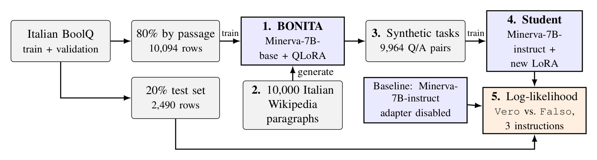

<div align="center">

# 🐟 BONITA

An Italian instantiation of [*Bonito*](https://github.com/BatsResearch/bonito): a model that turns **unannotated Italian text** into **instruction-tuning data** for boolean question answering.

[](pyproject.toml)
[](LICENSE)
[](https://huggingface.co/datasets/sapienzanlp/boolq_italian)

</div>

## Overview

[Bonito](https://aclanthology.org/2024.findings-acl.748/) (Nayak et al., 2024) is a model that, given a passage of raw text and a task type, generates a task for it: an instruction with its input, together with the expected answer. Running it over unannotated text yields an instruction-tuning dataset with no human annotation.

**BONITA** does the same for Italian, with boolean question answering as the task type: given a paragraph, it writes a yes/no question about it and its answer (`Vero`/`Falso`). BONITA is trained on [`sapienzanlp/Minerva-7B-base-v1.0`](https://huggingface.co/sapienzanlp/Minerva-7B-base-v1.0), a pretrained model as in Bonito, using [`sapienzanlp/boolq_italian`](https://huggingface.co/datasets/sapienzanlp/boolq_italian) from the [ita-bench](https://huggingface.co/collections/sapienzanlp/ita-bench-italian-benchmarks-for-llms-66337ca59e6df7d7d4933896) collection.

As in Bonito, BONITA is evaluated by what its data is used for: does a model trained only on BONITA's synthetic data answer human-labeled questions better than the same model without it?

The pipeline:

<p align="center"></p>

1. **Train BONITA** on 80% of BoolQ-Italian, split by passage so that no passage is shared with the test set.
2. **Collect** 10,000 unannotated paragraphs from Italian Wikipedia, the same kind of source as BoolQ.
3. **Generate** one question/answer pair per paragraph, discarding unparseable generations and duplicate questions.
4. **Train the student**, a QLoRA adapter on [`sapienzanlp/Minerva-7B-instruct-v1.0`](https://huggingface.co/sapienzanlp/Minerva-7B-instruct-v1.0), only on the synthetic tasks.
5. **Evaluate** the student and the baseline, Minerva-7B-instruct without fine-tuning, on the 2,490 test examples, choosing between ` Vero` and ` Falso` by log-likelihood.

The whole pipeline was run on a single NVIDIA GeForce RTX 3090 (24 GB). The notebook [`bonita.ipynb`](bonita.ipynb) runs every stage and shows its outputs; the method and the analysis of the results are described in the [report](report.pdf).

### Meta-template

Each example of BONITA's data becomes a prompt, the task type and the passage, followed by a completion, the task and its answer after `<|pipe|>`:

**Prompt:**

```text
<|tasktype|>
boolean question answering
<|context|>
{passage}
<|task|>
```

**Completion:**

```text
{instruction} {question} Vero o Falso?
<|pipe|>
Risposta: Vero/Falso
```

The four markers are added to the tokenizer as special tokens, and BONITA learns to generate both the question and its answer from a passage.

`{instruction}` is drawn at random from three equivalent Italian wordings, e.g. *"Dopo aver letto il passaggio, rispondi alla seguente domanda:"*; the test set is scored once with each of them.

## Results

BONITA turns 10,000 unannotated Wikipedia paragraphs into 9,964 tasks: only 4 generations cannot be parsed and 32 repeat an already kept question.

Accuracy and macro-F1, in %, on the 2,490 test examples, for each of the three instruction variants and their mean, computed in Section 8 of the [notebook](bonita.ipynb) and saved in [`results.json`](results.json). The baseline is Minerva-7B-instruct without fine-tuning; always answering `Vero` gives 61.0 accuracy and 37.9 macro-F1.

| Instruction | Baseline acc. | Baseline F1 | Student acc. | Student F1 |
| :---------- | ------------: | ----------: | -----------: | ---------: |
| 0           |          79.7 |        79.4 |         88.2 |       87.6 |
| 1           |          81.1 |        80.9 |         87.7 |       87.3 |
| 2           |          79.6 |        79.4 |         88.2 |       87.7 |
| **mean**    |          80.1 |        79.9 |     **88.0** |   **87.5** |

F1 is macro-F1. Instructions 0, 1 and 2 are the three Italian wordings.

## Repository structure

```text
.
├── bonita.ipynb             # full pipeline, results and error analysis (self-contained)
├── src/bonita/              # the notebook's code as a package, used by the scripts
│   ├── config.py            # model names, output paths, hyperparameters
│   ├── data.py              # BoolQ splits, meta-template, student/eval prompts
│   ├── wiki.py              # sampling of the Wikipedia paragraphs
│   ├── model.py             # 4-bit loading, LoRA, SFT training
│   ├── generation.py        # batched generation, parsing and filtering
│   └── evaluation.py        # log-likelihood scoring, accuracy and macro-F1
├── scripts/
│   ├── train_bonita.py      # stage 1: train BONITA
│   ├── generate.py          # stages 2-3: collect passages and generate the synthetic dataset
│   ├── train_student.py     # stage 4: train the student
│   └── evaluate.py          # stage 5: log-likelihood evaluation
├── ckpt/                    # BONITA and student adapters (see Resources)
├── results.json             # generation statistics and metrics
└── predictions.jsonl        # per-example test log-likelihoods, for the error analysis (see Resources)
```

## Resources

- **Slides**: [GitHub Pages — TODO](#) (source on the [`slides`](../../tree/slides) branch)
- **Report**: [`report.pdf`](report.pdf), with the full description of the method and the results
- **Checkpoints**: in the [project folder](https://drive.google.com/drive/folders/14D49IlFKMrmsdoaW5r-sQmNhbkeVxY5N), the [BONITA adapter and tokenizer](https://drive.google.com/drive/folders/1fhtEb1as812R5gX4Ia1gRR245-ut1uoj) (`ckpt/bonita_full/`) and the [student adapter](https://drive.google.com/drive/folders/11j1bIspr6NBVIWKXAmmUs1GM1KvwTBOD) (`ckpt/student_bonita/`); place them in `ckpt/` to skip the training stages
- **Data**: in the same folder, the [Wikipedia passages](https://drive.google.com/file/d/1zeSdbuN2n-zZ2Nh5hLwcfHQTY8Y0JqyW/view) (`wiki_passages.jsonl`), the [generated tasks](https://drive.google.com/file/d/1DFTBdmEZUq34UNDmzeAHe8hkFrIZKmnf/view) (`generated_tasks.jsonl`) and the per-example log-likelihoods of the test set written by the evaluation (`predictions.jsonl`); place them in the repository root to skip the passage collection, the generation and the evaluation, and to run the error analysis of Section 9 directly

## References

- Clark, C., Lee, K., Chang, M.-W., Kwiatkowski, T., Collins, M., & Toutanova, K. (2019). *BoolQ: Exploring the Surprising Difficulty of Natural Yes/No Questions.* NAACL-HLT 2019. [ACL Anthology](https://aclanthology.org/N19-1300/)
- Dettmers, T., Pagnoni, A., Holtzman, A., & Zettlemoyer, L. (2023). *QLoRA: Efficient Finetuning of Quantized LLMs.* NeurIPS 2023. [Proceedings](https://proceedings.neurips.cc/paper_files/paper/2023/hash/1feb87871436031bdc0f2beaa62a049b-Abstract-Conference.html)
- Hu, E. J., Shen, Y., Wallis, P., Allen-Zhu, Z., Li, Y., Wang, S., Wang, L., & Chen, W. (2022). *LoRA: Low-Rank Adaptation of Large Language Models.* ICLR 2022. [OpenReview](https://openreview.net/forum?id=nZeVKeeFYf9)
- Moroni, L., Conia, S., Martelli, F., & Navigli, R. (2024). *Towards a More Comprehensive Evaluation for Italian LLMs.* CLiC-it 2024. [ACL Anthology](https://aclanthology.org/2024.clicit-1.67/)
- Nayak, N. V., Nan, Y., Trost, A., & Bach, S. H. (2024). *Learning to Generate Instruction Tuning Datasets for Zero-Shot Task Adaptation.* Findings of ACL 2024. [ACL Anthology](https://aclanthology.org/2024.findings-acl.748/), [GitHub](https://github.com/BatsResearch/bonito)
- Orlando, R., Moroni, L., Huguet Cabot, P.-L., Conia, S., Barba, E., Orlandini, S., Fiameni, G., & Navigli, R. (2024). *Minerva LLMs: The First Family of Large Language Models Trained from Scratch on Italian Data.* CLiC-it 2024. [ACL Anthology](https://aclanthology.org/2024.clicit-1.77/)
- Sanh, V., Webson, A., Raffel, C., Bach, S. H., et al. (2022). *Multitask Prompted Training Enables Zero-Shot Task Generalization.* ICLR 2022. [OpenReview](https://openreview.net/forum?id=9Vrb9D0WI4)
- Wang, Y., Kordi, Y., Mishra, S., Liu, A., Smith, N. A., Khashabi, D., & Hajishirzi, H. (2023). *Self-Instruct: Aligning Language Models with Self-Generated Instructions.* ACL 2023. [ACL Anthology](https://aclanthology.org/2023.acl-long.754/)

## Acknowledgements

This project builds on the work of [Sapienza NLP](https://nlp.uniroma1.it/) at Sapienza University of Rome. BONITA and the student are both based on [Minerva](https://nlp.uniroma1.it/minerva/), their family of LLMs trained from scratch on Italian ([Minerva-7B-base](https://huggingface.co/sapienzanlp/Minerva-7B-base-v1.0) and [Minerva-7B-instruct](https://huggingface.co/sapienzanlp/Minerva-7B-instruct-v1.0) respectively), and the training and evaluation data come from their BoolQ-Italian and ita-bench. We thank them for making these resources openly available.

---

<div align="center">
<sub>Francesco Baiocchi & Leonardo Petrilli</sub>
</div>
